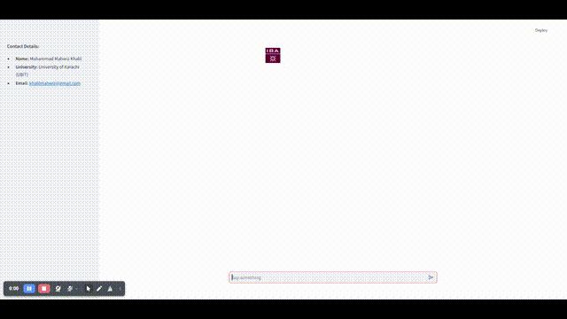

# probattle-05-nlp

A chatbot that used LangChain's Conversational Retrieval Chain to answer questions strictly based on provided documents. The bot retrieves relevant documents from a FAISS index and displays both the answer and the corresponding source documents. This repository also includes a video shows the results.
